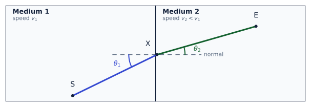
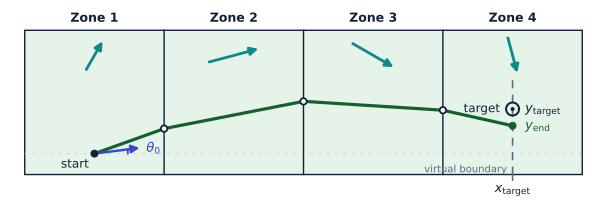
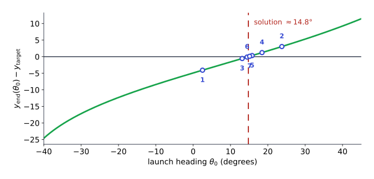

# From Snell's Law to Path Planning
*by Michaël Soulignac - Last change: 2026-09-28*

* [Try the interactive demo](https://michaelsoulignac.github.io/snell-path-planning)
* Explore the code on [GitHub](https://github.com/michaelsoulignac/snell-path-planning), all contributions are welcome!

## Abstract

How can we build a path planner for a drone flying through regions with different wind conditions?

Our starting point is the classical problem of light crossing different media. [Fermat's principle](https://en.wikipedia.org/wiki/Fermat%27s_principle) states that the travel time of a light ray is stationary with respect to small variations of its path. Applying this principle to the crossing point between two media leads to Snell's law.

We can use the same idea for a drone flying through regions with different uniform winds. The drone does not have a fixed ground speed, so the classical optical formula must be adapted to the drone's kinematics.

Our goal is to derive a Snell-like refraction law that allows us to propagate a path from one wind region to the next.

## 1. Snell's law

Consider two optical media in which light propagates at speeds $v_1$ and $v_2$, separated by a boundary.
Let $\vec{u}$ be the unit tangent vector of this boundary.

A ray travels from a point $S$ in medium 1 to a point $E$ in medium 2, crossing the boundary at $X$.
For a given crossing point $X$, the total travel time is:

$$
T(X) = \frac{SX}{v_1} + \frac{XE}{v_2}
$$

where $SX$ and $XE$ denote the distances from $S$ to $X$ and from $X$ to $E$.

Let the crossing point move by a small displacement $dl$ along the boundary, in the direction of $\vec{u}$.
The vector $\overrightarrow{SX}$ then changes by $+\vec{u}\,dl$, while the vector $\overrightarrow{XE}$ changes by $-\vec{u}\,dl$.

If $\theta_1$ and $\theta_2$ are the angles between the rays and the normal to the boundary (pointing from medium 1 to medium 2), measured in the same rotational sense, then projecting these displacements onto the rays shows that, for a small $dl$, the lengths $SX$ and $XE$ change by $\sin\theta_1\,dl$ and $-\sin\theta_2\,dl$.

The travel time therefore changes by:

$$
dT = \frac{\sin\theta_1}{v_1}\,dl - \frac{\sin\theta_2}{v_2}\,dl
$$

At a stationary crossing point, $dT=0$. Therefore:

$$
\boxed{
\frac{\sin\theta_1}{v_1} = \frac{\sin\theta_2}{v_2}
}
$$

This result is known as [Snell's law](https://en.wikipedia.org/wiki/Snell%27s_law).
It is usually written in terms of the refractive indices $n_i$:

$$
n_1\sin\theta_1 = n_2\sin\theta_2
$$

where:

$$
n_i = \frac{c}{v_i}
$$

and $c$ is the speed of light in vacuum.

!!! note
The important idea for our planner is not the optical index itself, but the principle behind the derivation: Fermat's principle of stationarity.

Let's apply the same reasoning to the drone!

## 2. The drone model

For pedagogical purposes, we consider rectangular and contiguous wind regions, placed side by side along a line, so that all boundaries are parallel.
This choice simplifies the demonstration, while the local refraction law extends to more general geometries.

In each wind region, the wind is assumed to be uniform, and the drone flies at the same airspeed in all regions.

Throughout this section:

* $v$ is the drone's airspeed
* $\vec{c}$ is the wind vector
* $\vec{e}$ is the drone's heading unit vector
* $\vec{g}=v\vec{e}+\vec{c}$ is the ground velocity
* $w=\vec{g}\cdot\vec{e}=v+\vec{c}\cdot\vec{e}$ is the component of the ground velocity along the heading

The drone moves forward, along its heading, if and only if $w>0$.

Consider a drone crossing a boundary between two such wind regions, 1 and 2.
In region $i$, the wind is $\vec{c}_i$, the drone's heading is $\vec{e}_i$, and $w_i=v+\vec{c}_i\cdot\vec{e}_i$.

As in Section 1, let $S$ be the starting point in region 1, $E$ the end point in region 2, $X$ the crossing point on the boundary, and $\vec{u}$ the unit tangent vector of the boundary.

For a segment with displacement $\vec{d}$, let $\tau(\vec{d})$ denote its travel time.

Let the crossing point move by a small displacement $dl$ along the boundary, in the direction of $\vec{u}$.

!!! note "Details on the two segment variations"
Moving $X$ by $\vec{u}\,dl$ gives

    $$
    d\overrightarrow{SX}=\vec{u}\,dl,
    \qquad
    d\overrightarrow{XE}=-\vec{u}\,dl
    $$

This is the variation induced by moving the crossing point along the boundary.

For a given segment, the drone flies at constant heading $\vec{e}$, so its displacement satisfies:

$$
\vec{d}=(v\vec{e}+\vec{c})\tau
$$

Equivalently:

$$
\vec{d}-\vec{c}\tau=v\tau\,\vec{e}
$$

!!! note "Details on the differential"
Although the heading is constant along each segment, it may vary when the segment displacement is varied.
Taking the differential therefore gives

    $$
    d\vec{d}-\vec{c}\,d\tau =
    v\vec{e}\,d\tau+v\tau\,d\vec{e}
    $$

    Taking the dot product with $\vec{e}$ gives

    $$
    \vec{e}\cdot d\vec{d} - (\vec{e}\cdot\vec{c})\,d\tau =
    v\,d\tau + v\tau\,\vec{e}\cdot d\vec{e}
    $$

    Since $\vec{e}$ is a unit vector,

    $$
    \vec{e}\cdot d\vec{e}=0
    $$

    Therefore,

    $$
    \vec{e}\cdot d\vec{d} =
    \left(v+\vec{c}\cdot\vec{e}\right)d\tau
    $$

    Since $w=v+\vec{c}\cdot\vec{e}$,

    $$
    d\tau=\frac{\vec{e}\cdot d\vec{d}}{w}
    $$

Applying this relation to the two segments gives:

$$
d\tau_1 = \frac{\vec{e}_1\cdot\vec{u}}{w_1}\,dl,
\qquad
d\tau_2 = -\frac{\vec{e}_2\cdot\vec{u}}{w_2}\,dl
$$

Let $T=\tau_1+\tau_2$ be the total travel time.

Therefore, the total travel time changes by:

$$
dT =
\left(
\frac{\vec{u}\cdot\vec{e}_1}{w_1}
-
\frac{\vec{u}\cdot\vec{e}_2}{w_2}
\right)
dl
$$

At a stationary crossing point, $dT=0$, thus:

$$
\frac{\vec{u}\cdot\vec{e}_1}{w_1} =
\frac{\vec{u}\cdot\vec{e}_2}{w_2}
$$

As in Section 1, let $\theta_i$ be the angle between the heading $\vec{e}_i$ and the normal to the boundary, measured in the same rotational sense.
Then $\vec{u}\cdot\vec{e}_i=\sin\theta_i$, and the law therefore reads:

$$
\boxed{
\frac{\sin\theta_1}{w_1} =
\frac{\sin\theta_2}{w_2}
}
$$

This is the drone's analogue of Snell's law. Nice result, isn't it?

## 3. Several wind regions: the conserved quantity

Consider now a chain of wind regions separated by parallel boundaries, as in Section 2, but with more than two regions.

Since the boundaries are parallel, $\vec{u}$ is the same at every crossing. The law derived in Section 2 therefore holds at each boundary in turn, and the quantity

$$
\frac{\vec{u}\cdot\vec{e}}{w}
$$

has the same value in every region crossed by the path. We call this common value $\lambda$:

$$
\boxed{
\lambda = \frac{\vec{u}\cdot\vec{e}}{w}
}
$$

For the $x$-$y$ coordinate system used here, $\vec{e}=(\cos\theta,\sin\theta)$.
For boundaries orthogonal to the $x$-axis, $\vec{u}=(0,1)$, and $\lambda$ takes the explicit form:

$$
\lambda = \frac{\sin\theta}{v+c_x\cos\theta+c_y\sin\theta}
$$

where $\theta$ is the heading in the region, and $(c_x,c_y)$ the wind there.

The launch heading fixes $\lambda$ in the first region. The same $\lambda$ then fixes the heading in every subsequent region, without solving a new stationarity condition at each boundary.

## 4. Recovering the heading from $\lambda$

Given a wind $\vec{c}=(c_x,c_y)$ and the invariant $\lambda$, the heading $\theta$ in that region satisfies:

$$
\lambda\big(v+c_x\cos\theta+c_y\sin\theta\big) = \sin\theta
$$

Rearranging:

$$
-\lambda c_x\cos\theta + (1-\lambda c_y)\sin\theta = \lambda v
$$

Writing the left-hand side as $R\sin(\theta-\phi)$, with

$$
A = 1-\lambda c_y, \qquad B = \lambda c_x, \qquad R = \sqrt{A^2+B^2}, \qquad \phi = \operatorname{atan2}(B,A)
$$

gives:

$$
\sin(\theta-\phi) = \frac{\lambda v}{R}
$$

This has two solutions:

$$
\boxed{
\theta = \phi + \arcsin\!\left(\frac{\lambda v}{R}\right)
\qquad\text{or}\qquad
\theta = \phi + \pi - \arcsin\!\left(\frac{\lambda v}{R}\right)
}
$$

!!! warning
This gives two mathematical solutions, but only one (the heading lying in the admissible sector defined in Section 5) corresponds to a physically valid path.

## 5. Admissible headings

Not every heading gives a usable path. The drone must move forward across the region, and its travel time must stay finite. This requires:

$$
g_x = v\cos\theta+c_x > 0
\qquad\text{and}\qquad
w = v+c_x\cos\theta+c_y\sin\theta > 0
$$

The first condition ensures the drone progresses across the region; the second ensures it moves forward along its own heading, as in Section 2.

Therefore, admissible headings form an angular sector, determined by the wind and the orientation of the boundaries.

## 6. Monotonicity of $\lambda$

Differentiating $\lambda(\theta)=\sin\theta/w$ with respect to $\theta$ gives:

$$
\frac{d\lambda}{d\theta} = \frac{v\cos\theta+c_x}{w^2} = \frac{g_x}{w^2}
$$

!!! note "Details on the differentiation"
By the quotient rule,

    $$
    \frac{d\lambda}{d\theta} =
    \frac{\cos\theta\cdot w-\sin\theta\cdot w'}{w^2}
    $$

    where

    $$
    w'=-c_x\sin\theta+c_y\cos\theta
    $$

    Expanding the numerator gives

    $$
    \cos\theta\left(v+c_x\cos\theta+c_y\sin\theta\right) -
    \sin\theta\left(-c_x\sin\theta+c_y\cos\theta\right)
    $$

    which simplifies to

    $$
    v\cos\theta+c_x(\cos^2\theta+\sin^2\theta) =
    v\cos\theta+c_x
    $$

    using $\cos^2\theta+\sin^2\theta=1$.

On the admissible sector, $g_x>0$ and $w>0$, so:

$$
\boxed{
\frac{d\lambda}{d\theta} > 0
}
$$

Thus $\lambda$ increases strictly with the heading on the admissible sector: to each admissible $\lambda$ corresponds a unique heading.

!!! note "Details on the monotonicity of the vertical displacement"
Consider a region of horizontal width $\Delta x$.
The vertical displacement across that region is

    $$
    \Delta y =
    \Delta x\,\frac{g_y}{g_x} =
    \Delta x\,\frac{v\sin\theta+c_y}{v\cos\theta+c_x}
    $$

    Differentiating with respect to $\theta$ gives

    $$
    \frac{d(\Delta y)}{d\theta} =
    \Delta x\, \frac{v\,w}{g_x^2}
    $$

    On the admissible sector, $g_x>0$ and $w>0$. Since $\Delta x>0$ and $v>0$,

    $$
    \frac{d(\Delta y)}{d\theta}>0
    $$

    Therefore, the vertical displacement across a region is strictly increasing with the heading.

## 7. Reaching a target

Suppose the drone has to reach a target, with abscissa $x_{\text{target}}$, possibly inside a wind region rather than exactly on a boundary:

The vertical line $x = x_{\text{target}}$ can then be treated as a *virtual* boundary: since the wind is uniform within the region, crossing it does not change the heading, but it lets us read off the drone's position at that abscissa.

For a given launch heading $\theta_0$, the invariant $\lambda$ is fixed in the first region. It then determines the heading in every subsequent region, so the path can be propagated up to $x_{\text{target}}$, reaching some ordinate $y_{\text{end}}(\theta_0)$.

Since $x_{\text{target}}$ is fixed, this leaves a single scalar equation for a single unknown, $\theta_0$:

$$
y_{\text{end}}(\theta_0) = y_{\text{target}}
$$

The original, two-dimensional path-planning problem is thus reduced to a one-dimensional root-finding problem in the launch heading.

## 8. Solving by bisection

Increasing the launch heading $\theta_0$ increases $\lambda$ in the first region.
Since $\lambda$ is strictly increasing with the heading in every admissible region, the heading in every subsequent region also increases.
The vertical displacement across each region increases with the heading as well.
Therefore, $y_{\text{end}}$ is strictly increasing with $\theta_0$.

!!! note "Why bisection applies"
Because $y_{\text{end}}$ is strictly increasing on the admissible interval, the equation

    $$
    y_{\text{end}}(\theta_0)=y_{\text{target}}
    $$

    has at most one solution.

    As long as all headings remain admissible, $y_{\text{end}}(\theta_0)$ depends continuously on $\theta_0$.

    Therefore, if an interval $[\theta_{\min},\theta_{\max}]$ satisfies

    $$
    \big(y_{\text{end}}(\theta_{\min})-y_{\text{target}}\big)
    \big(y_{\text{end}}(\theta_{\max})-y_{\text{target}}\big)<0
    $$

    then the intermediate value theorem guarantees a solution inside the interval, and bisection can be used to locate it.

Bisection proceeds as follows:

* Starting from an interval $[\theta_{\min}, \theta_{\max}]$ of admissible launch headings, on which $y_{\text{end}}$ changes sign relative to $y_{\text{target}}$, the interval is repeatedly halved, keeping the half on which the sign change still occurs.
* Each iteration propagates one candidate path through every region (using the closed-form inversion of Section 4) and compares the resulting $y_{\text{end}}$ to $y_{\text{target}}$.

The curve below shows the target error $y_{\text{end}}(\theta_0)-y_{\text{target}}$ as a function of the launch heading. The solution corresponds to its zero crossing.
Each iteration is represented by a numbered dot.

## Conclusion

A path-planning problem that may involve many wind regions and different wind conditions can thus be reduced to a one-dimensional problem: finding the initial heading.

Once this single parameter is found, the Snell-like invariant determines the heading in every subsequent region, and therefore the complete path.

## Acknowledgements

I would like to warmly thank two people whose ideas and insights clearly contributed to this work, and without whom it would not have been possible:

**Sofiane Tafat**, a former professor of physics at EISTI (now CY Tech), who first put me on the right track. He suggested the idea of looking for a solution based on "*the equivalent of Fermat’s principle for light*".
I gladly credit him with this original idea. Our correspondence at the time, however, ended with: "*It remains to solve this equation.*” :)

**Benjamin Parent**, a former professor of mathematics at ISEN Lille (now part of Junia), for his vector formulation of the problem, in particular the expression of the gradient of the travel time with respect to the displacement:

$$
\nabla_{\vec d}\tau =
\frac{\vec v}{\vec v\cdot(\vec v+\vec c)}
$$

where $\vec v=v\vec e$ is the air-velocity vector.

This is exactly the vector form of the identity derived in Section 2:

$$
\nabla_{\vec d}\tau=\frac{\vec e}{w}
$$

This was clearly the missing piece that made it possible to apply Fermat’s principle to the drone in practice, turning Sofiane’s intuition into a concrete derivation of the Snell law analogue.